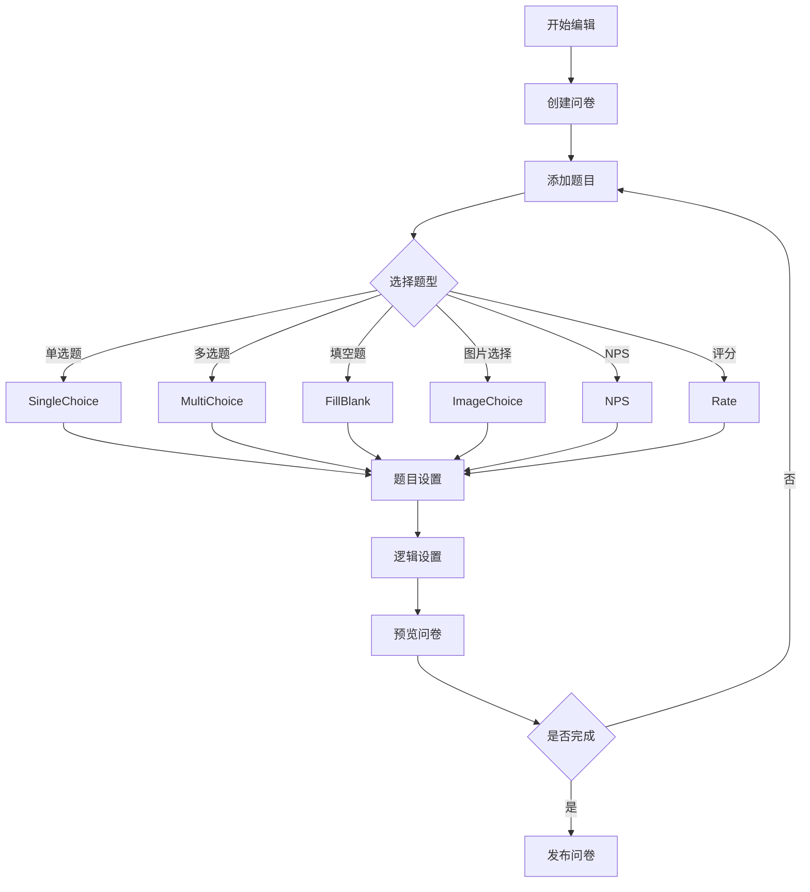
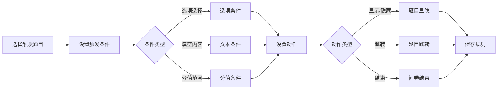
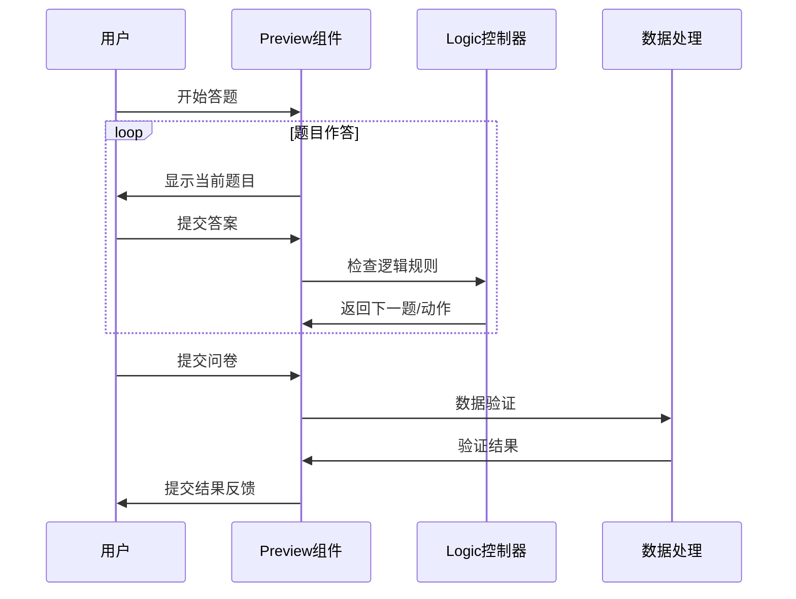
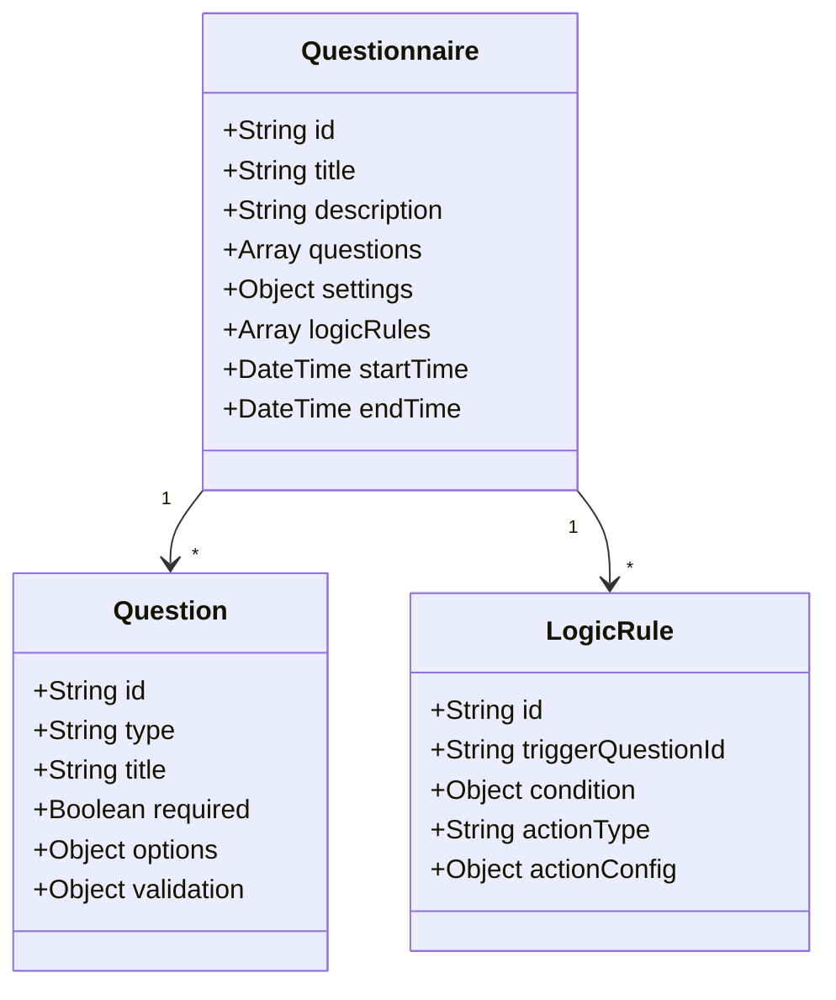

# 问卷系统模块说明文档

## 模块概述

问卷系统是 MPAdmin 的一个核心模块，提供完整的问卷设计、编辑、预览和逻辑控制功能。本模块采用 Vue 3 + Ant Design Vue 4.x 开发，支持多种题型和复杂的逻辑控制。

## 核心文件说明

### 主要功能文件

#### 1. Editor.vue

问卷编辑器的核心组件，提供以下功能：

- 题目的添加、编辑、删除、复制
- 拖拽排序功能
- 题目预览
- 题型切换
- 批量操作
- 撤销/重做功能

#### 2. Logic.vue

问卷逻辑控制器，实现：

- 条件跳转设置
- 选项显示/隐藏控制
- 多条件组合逻辑
- 逻辑规则验证
- 实时逻辑预览

#### 3. Preview.vue

问卷预览组件，功能包括：

- 实时预览问卷
- 移动端适配
- 答题进度显示
- 逻辑跳转执行
- 数据收集

#### 4. Settings.vue

问卷设置管理，包含：

- 基础信息设置（描述、时间等）
- 显示设置（进度条、题号等）
- 提交设置（重复提交控制等）

#### 5. Project.vue

问卷项目管理，提供：

- 问卷基本信息展示
- 状态管理
- 操作入口

### 题型组件 (components/)

#### 1. SingleChoice.vue

单选题组件，特点：

- 支持单选按钮和下拉框两种形式
- 选项排列方式可配置
- 支持其他选项填写

#### 2. MultiChoice.vue

多选题组件，功能：

- 最少/最多选择限制
- 选项排列方式可配置
- 支持其他选项填写
- 选项互斥设置

#### 3. FillBlank.vue

填空题组件，支持：

- 单行/多行文本
- 字数限制
- 输入验证
- 占位符设置

#### 4. ImageChoice.vue

图片选择题组件，特性：

- 支持单选/多选模式
- 图片上传和预览
- 图片布局配置
- 响应式展示

#### 5. NPS.vue

净推荐值题型，包含：

- 0-10分打分机制
- 自定义文案
- 分数说明
- 数据统计

#### 6. Rate.vue

评分题组件，提供：

- 星级评分
- 自定义图标
- 半星选择
- 评分说明

### 工具文件

#### cleanup.js

问卷数据清理工具：

- 无效数据清理
- 数据格式标准化
- 冗余数据处理
- 数据完整性检查

## 数据流转

1. 编辑流程：

   - Editor.vue 中进行问卷编辑
   - 通过 Settings.vue 配置问卷属性
   - 在 Logic.vue 中设置逻辑规则
   - 使用 Preview.vue 预览效果

2. 答题流程：
   - Preview.vue 展示问卷
   - 根据 Logic.vue 中的规则控制显示逻辑
   - 数据提交时进行验证和处理

## 开发指南

### 添加新题型

1. 在 components 目录创建新的题型组件
2. 实现必要的接口：
   - v-model 数据绑定
   - 编辑/预览模式切换
   - 验证方法
3. 在 Editor.vue 中注册新题型
4. 在 Logic.vue 中添加对应的逻辑支持

### 扩展逻辑规则

1. 在 Logic.vue 中定义新的规则类型
2. 实现规则验证方法
3. 添加规则执行逻辑
4. 更新预览组件中的规则处理

## 注意事项

1. 数据处理

   - 所有题目数据必须包含唯一 ID
   - 注意处理选项的依赖关系
   - 保持数据结构的一致性

2. 性能优化

   - 大量选项时使用虚拟滚动
   - 合理使用计算属性和缓存
   - 避免深层数据监听

3. 逻辑控制

   - 避免循环依赖
   - 控制逻辑规则复杂度
   - 注意规则优先级

4. 用户体验
   - 保持编辑器操作流畅
   - 提供清晰的错误提示
   - 自动保存重要数据

## 流程图

### 问卷编辑流程

### 逻辑控制流程

### 答题流程

### 数据结构

这些流程图展示了：

1. 问卷编辑的完整流程
2. 逻辑规则的设置流程
3. 用户答题的交互流程
4. 核心数据结构的关系

流程图使用 Mermaid 语法编写，可以在支持 Mermaid 的 Markdown 查看器中直接渲染。
